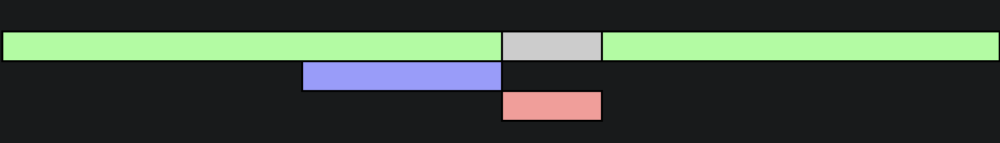
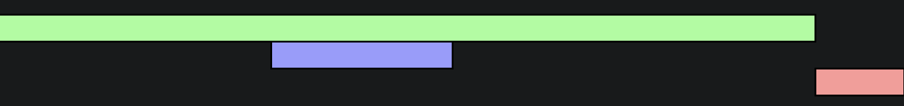

将 `JavaScript` 引入页面的主要方式是通过使用 `<script></script>` 元素，`script` 的不同属性和加载位置决定了其表现行为。

## script 标签位置

```html
<!DOCTYPE html>
<html lang="en">
<head>
  <meta charset="UTF-8">
  <meta http-equiv="X-UA-Compatible" content="IE=edge">
  <meta name="viewport" content="width=device-width, initial-scale=1.0">
  <title>JS in HTML</title>
  <!-- script -->
</head>
<body>
  <div>
    <!-- other content -->
  </div>
  <!-- script -->
</body>
</html>

```

通常，`<script>` 元素有两种放置方法：
- 放置于 `<head></head>` 标签内。将标签放置于此处，通常意味着必须将所有的 JS 代码下载、解析和解释完成后才能开始渲染页面。在需要加载大量 JS 的页面，会导致明显的页面渲染延迟，期间浏览器窗口完全空白。
- 放置于 `<body></body>` 标签的内容后。将标签放置于此处，JS 代码将会在页面完全渲染后才被处理，相比于放置于 `<head>` 标签内，能使得用户能够明显的感觉页面加载得更快。

## script 标签属性

### async

对于普通脚本，如果存在 `async` 属性，那么普通脚本会被并行请求，并尽快解析和执行。 对于模块脚本，如果存在 `async` 属性，那么脚本及其所有依赖都会在延缓队列中执行，因此它们会被并行请求，并尽快解析和执行。

> `async` 脚本的执行顺序不定，先加载完毕的脚本先执行。</br>
> `async` 特性仅适用于外部脚本。</br>
> 如果 `<script>` 标签没有 `src` 特性（attribute），那么 `async` 特性会被忽略。



`async` 脚本会在后台加载，并在加载就绪时运行。DOM 和其他脚本不会等待它们，它们也不会等待其它的东西。async 脚本就是一个会在加载完成时执行的完全独立的脚本。

当我们将独立的第三方脚本集成到页面时，此时采用异步加载方式是非常棒的：计数器，广告等，因为它们不依赖于我们的脚本，我们的脚本也不应该等待它们。

### defer

通知浏览器该脚本将在文档完成解析后，触发 DOMContentLoaded 事件前执行。 有 `defer` 属性的脚本会阻止 DOMContentLoaded 事件，直到脚本被加载并且解析完成。

> 具有 `defer` 特性的脚本保持其相对顺序，就像常规脚本一样。</br>
> `defer` 特性仅适用于外部脚本，如果 `<script>` 脚本没有 `src`，则会忽略 `defer` 特性。



### src

定义引用外部脚本的 URI，这可以用来代替直接在文档中嵌入脚本。

指定了 `src` 的 `<script>` 元素标签内不应该再有嵌入的脚本。若标签内还包含有其他 JS 代码，浏览器会忽视内部的代码。

### integrity

允许浏览器检查其获得的资源（例如从 CDN 获得的）是否被篡改。通过验证获取文件的哈希值是否和你提供的哈希值一样来判断资源是否被篡改。

如果验证不通过，脚本不会执行。

```html
<script
  src="https://example.com/example-framework.js"
  integrity="sha384-oqVuAfXRKap7fdgcCY5uykM6+R9GqQ8K/uxy9rx7HNQlGYl1kPzQho1wx4JwY8wC"
  crossorigin="anonymous"></script>
```

### crossorigin

匹配相关请求的 CORS 设置，默认不启用 CORS。

根据配置值的不同，使用不同的请求策略：
- `anonymous`：请求使用了 CORS 标头，且证书标志被设置 'same-origin'。不会通过 cookies、客户端 SSL 证书或 HTTP 认证交换用户凭据，除非目的地是同一来源。
- `use-credentials`：出站请求总是包含用户凭证。
- 空值：设置为 `crossorigin` 或 `crossorigin=""` 将会与 `anonymous` 拥有一样的表现效果。

### type

属性定义 `<script>` 元素包含或 src 引用的脚本语言，其属性值为 `MIME` 类型：
- `text/javascript`
- `text/ecmascript`
- `application/javascript`
- `application/ecmascript`

如果没有定义这个属性，脚本会被视作 JavaScript。 如果 `MIME` 类型不是 JavaScript 类型（上述支持的类型），则该元素所包含的内容会被当作数据块而不会被浏览器执行。

如果 `type` 属性的值是 `module`，那么 `<script>` 内代码将会视作 `ES6` 模块，可以出现 `import`、`export` 关键字。

```html
<script type="module">
  import myLib from 'path';
</script>
```

## 动态加载脚本

除了使用 `<script>` 标签加载脚本，还可以通过 JS 使用 DOM API 向 DOM 中动态的添加 `script` 元素，以达到动态加载的效果。

```html
<script>
  const script = document.createElement('script');
  script.src = 'script uri';
  document.body.appendChild(script);
</script>
```

以此种方法加载的脚本属于异步加载，即相当于添加 `async` 属性，若需要同步加载，将 `async` 设置为 `false` 即可：

```js
script.async = false;
```

## noscript

针对早期浏览器不支持 JavaScript 的问题，`noscript` 提供了一个页面降级的处理方案。

`<noscript>` 用于给不支持 JavaScript 的浏览器提供替换的内容。

任何可以出现在 `<body>` 标签中的 HTML 元素都可以出现在 `<noscript>` 标签内，`<script>` 除外。

在以下两种情况中，`<noscript>` 中的内容将显示：
- 浏览器不支持脚本
- 用户禁用了浏览器脚本

