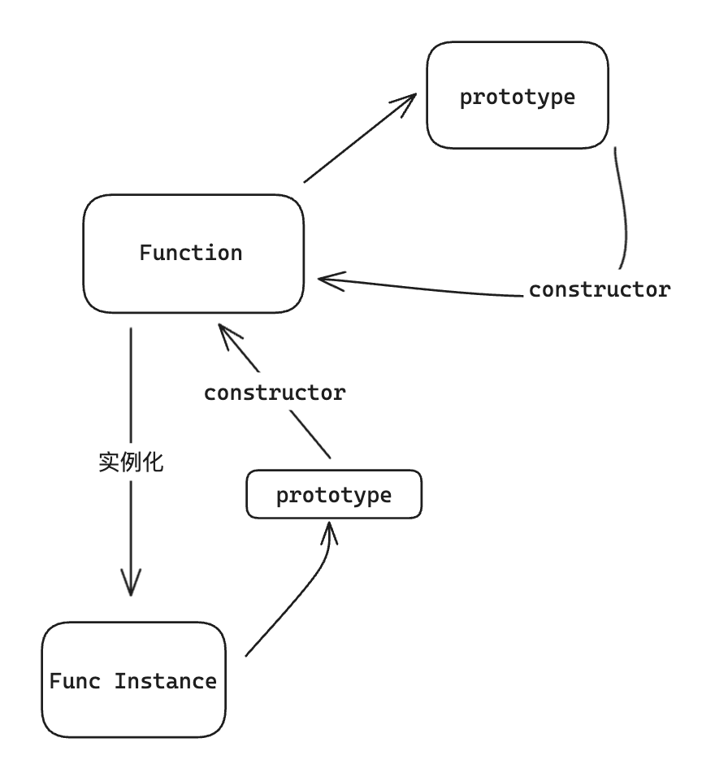

`js` 拥有 7 种简单的数据类型和 1 种复杂的数据类型：

- `Undefined、Null、Boolean、Number、BigInt、String、Symbol`
- `Object`

## 类型判断

有多种方法来确定变量的数据类型，每种方法都有其特点

### `typeof`

对一个值使用 `typeof` 操作符会返回字符串类型：

- `undefined`
- `boolean`
- `string`
- `number`
- `object`
- `function`
- `symbol`

```js
typeof true; // boolean
typeof 1; // number
typeof '1'; // string
typeof undefined; // undefined
typeof null; // object
typeof []; // object
typeof {}; // object
typeof () => {}; // function
typeof Symbol(); // symbol
```

`typeof` 操作符不能准确的区分 `null` 和数组类型。

### `instanceof`

**`instanceof`** **运算符**用于检测构造函数的 `prototype` 属性是否出现在某个实例**对象**的原型链上，返回一个布尔值。

内部原理：`Object.getPrototypeOf(obj) === Constructor.prototype`。

```js
[] instanceof Array; // true
'string' instanceof String; // false，只能用于对象类型的判断
new String('string') instanceof String; // true，使用包装类创建的基本类型
```

### `constructor`

当一个函数被定义时，JS引擎会为添加 `prototype` 原型，然后在 `prototype` 上添加一个 `constructor` 属性，并让其指向函数的引用，函数利用原型对象的 `constructor` 属性引用了自身，当函数作为构造函数创建对象时，原型上的 `constructor` 属性被遗传到了新创建的对象上，从原型链角度讲，构造函数就是新对象的类型。



```js
(new Date()).constructor === Date; // true
(new Error()).constructor === Error; // true
```

### `Object.prototype.toString.call()`

最准确的判断类型的方法，返回值为一个字符串，格式：[object Type]

`Type` 为类型，能准确的区分 `null`、数组类型、函数类型。
